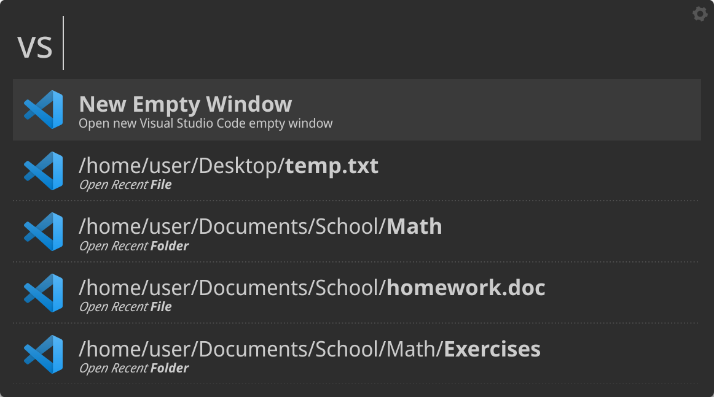
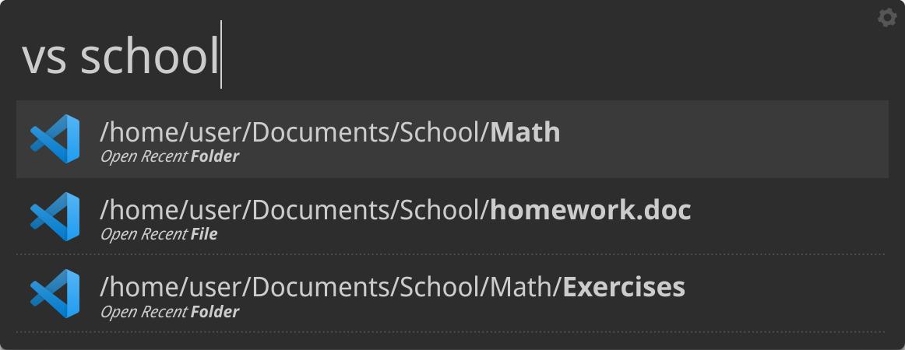

# albert-vscode

Simple unofficial [albert-launcher](https://github.com/albertlauncher/albert) extension that shows and opens recent Visual Studio Code files and folders.

The trigger to activate the extension is `vs`.



After the trigger you can insert the query to filter the results.



## Installation

To install the extension type the following in your terminal:

```
git clone https://github.com/mparati31/albert-vscode ~/.local/share/albert/org.albert.extension.python/modules/vscode
```

Now active the extension: open albert's settings and go to `Extensions > Python > Visual Studio Code` and check the checkbox.
